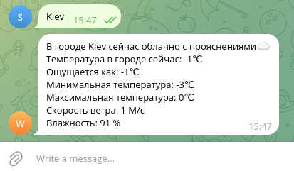

How to use:
1. Install Python, pip and needed Python modules

```shell

sudo apt -y install python3 python3-pip

pip3 install pyowm pyTelegramBotAPI python-dotenv

```

2. Export variables:

```shell

TELEGRAM_BOT_TOKEN="your_telegram_bot_token"
OPENWEATHERMAP_API_KEY="Your_OPENWEATHERMAP_API_KEY"

```
3. Run script

```shell

python3 telegram_bot.py

```

4. Go to the telegram bot and send it the name of the city.
    (e.g. Kiev)


    
